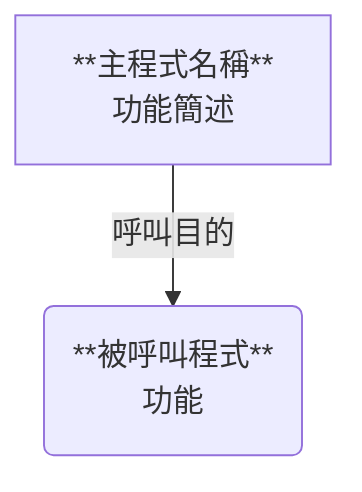

# COBOL BSD 分析技術規格書產出 Skill

本 Skill 的任務：將 AS/400 IBM i COBOL 原始碼轉換為標準化繁體中文 BSD（Business Specification Document / 技術規格書），格式固定，並以 Markdown 輸出。

---

## Step 0：識別輸入檔案

使用者通常會提供以下檔案：
- **COBOL 程式碼**：主要分析對象（如 `FSPCS01B_CBL.TXT`）
- **BSD 格式範本**（選用）：若使用者提供格式範本，先讀取其 BSD 結構，作為輸出格式依據

若使用者有提供格式範本，先用 `view` 讀取範本確認 BSD 結構。否則直接使用本 Skill 內建的格式範本（見下方）。

---

## Step 1：確認檔案位置並複製到工作目錄

```bash
# 確認上傳檔案
ls /mnt/user-data/uploads/

# 複製到工作目錄（避免路徑含中文造成問題）
cp "/mnt/user-data/uploads/程式名稱.TXT" /home/claude/程式名稱.TXT
wc -l /home/claude/程式名稱.TXT
```

> **注意**：若 bash 指令失敗（例如檔案名稱含中文），改用 `view` 工具查看目錄後再複製。

---

## Step 2：依 COBOL 結構拆分檔案
**無論行數多少，一律使用 `scripts/cobol_splitter.py` 進行結構化拆分。**

### 2.1 取得腳本路徑

```bash
# 找出本 Skill 的實際安裝路徑
SKILL_DIR=$(find ~/.claude/skills -name "cobol_splitter.py" 2>/dev/null | head -1 | xargs dirname | xargs dirname)
echo "Skill 路徑：$SKILL_DIR"
```

### 2.2 執行拆分

```bash
mkdir -p /home/claude/output
python3 "$SKILL_DIR/scripts/cobol_splitter.py" /home/claude/程式名稱.TXT /home/claude/output/
```

拆分完成後，終端機會顯示每個 Part 的行數與內容，例如：

```
共拆分為 9 個 Part：
  Part  1 (  63 行)：IDENTIFICATION + ENVIRONMENT DIVISION
  Part  2 ( 173 行)：DATA DIVISION（FILE + WORKING-STORAGE + LINKAGE）
  Part  3 ( 187 行)：0000-START-PROGRAM, 1000-INITIZATION, ...
  Part  4 ( 250 行)：3000-CHECK-FUNCTION-KEY, 4000-ADD-PROCESS, ...
  Part  5 ( 253 行)：7000-MOVE-TO-CUST, 7100-INIT-SCREEN, ...
  Part  6 ( 441 行)：9510-CHECK-SCREEN1
  Part  7 ( 121 行)：9510-CHECK-EXIT, 9520-CHECK-SCREEN2, ...
  Part  8 ( 474 行)：9530-CHECK-SCREEN3
  Part  9 (  86 行)：9530-CHECK-EXIT, 9600-DECIDE-FIELDS, ...
完成！
```

### 2.3 拆分規則說明

| Part | 內容 | 說明 |
| :--- | :--- | :--- |
| Part 1 | IDENTIFICATION + ENVIRONMENT DIVISION | 含前置注解與 PROCESS GRAPHIC（從第 1 行到 DATA DIVISION 前） |
| Part 2 | DATA DIVISION | FILE SECTION + WORKING-STORAGE SECTION + LINKAGE SECTION 全部合併 |
| Part 3~N | PROCEDURE DIVISION PARAGRAPH 群組 | 貪婪合併，每 Part 上限 300 行 |
| — | PROCEDURE DIVISION（極小程式） | 整個 PROCEDURE DIVISION < 300 行時，不切分，整體一個 Part |

> **注意**：
> - 單一 PARAGRAPH 超過 300 行時，不強制切割，整個 PARAGRAPH 獨立成一個 Part
> - `EXIT.` 行視為 PARAGRAPH 結束標誌，永遠合併到所屬 PARAGRAPH 的 Part
> - SECTION 宣告（如 `MAIN-PROGRAM SECTION.`）合併到下一個 PARAGRAPH 群組的 Part

---

## Step 3：依序讀取每個 Part

```bash
# 確認 Part 清單
ls /home/claude/output/
```

**讀取順序：**
1. `view /home/claude/output/程式名稱_Part1.TXT` → 分析 IDENTIFICATION + ENVIRONMENT DIVISION
2. `view /home/claude/output/程式名稱_Part2.TXT` → 分析 DATA DIVISION（檔案、變數、參數定義）
3. `view /home/claude/output/程式名稱_Part3.TXT` → 分析主流程 PARAGRAPH 群組
4. 依序讀取直到最後一個 Part

> **重要**：每個 Part 讀取後立即記錄已分析的 PARAGRAPH 清單，確保不重複也不遺漏。

---

## Step 4：程式類型判斷

- FILE-CONTROL 中有 `WORKSTATION` 字樣的 SELECT → **ONLINE**
- 否則 → **BATCH**

---

## Step 5：產出 BSD 文件

### 最高指令（絕對遵守）

1. **第 2 節業務規則**：以純業務語言描述，**嚴禁**出現欄位英文縮寫（如 LINK-FUNC）、程式指令（如 EVALUATE、IF）或指標代號；窮舉每一個 IF/ELSE、EVALUATE/WHEN 判斷分支，各自獨立一列，**絕不合併或省略**
2. **6.2 段落功能分析**：描述「程式的行為」（讀了什麼、計算了什麼、寫了什麼），不解釋業務理由
3. **6.4 演算法**：每種情境完整列出「業務說明 + 計算公式 + 拆解結果」，**禁止「以此類推」**
4. **完整性 > 簡潔**：寧可輸出較長文件，也不能省略任何邏輯分支
5. **6.4 演算法【強制完整輸出 — 適用所有程式】**
   撰寫 6.4 之前，必須先執行以下流程，不得跳過：
   1. **先盤點**：掃描所有 Part，找出程式中所有需要在 6.4 展開的演算法段落，列出段落名稱與該段落內的情境總數
   2. **逐一展開**：每個段落的每個情境，都必須各自獨立寫出「業務說明 + 計算公式 + 拆解結果」，不允許以任何方式省略（包括「以此類推」、「邏輯同上」、「結構類似，不再重複」等說法）
   3. **跨段落不得共用**：即使兩個段落邏輯高度相似，也必須各自完整展開，因為相似不代表完全相同，省略即代表遺漏
   4. **數量自我驗收**：每個段落寫完後，確認輸出的情境數量與步驟 1 盤點的數量一致；全部段落寫完後，確認段落總數與步驟 1 盤點的段落總數一致

---

## BSD 輸出格式（固定結構）

以下為完整格式，**嚴格遵循**，不得增刪章節編號。

---

```markdown
# **[程式名稱] BSD**

## **程式 ID**: `[PROGRAM-ID]`
**程式名稱**: `[根據註解推斷]`
**作者**: `[PROGRAMMER 欄位]`
**撰寫日期**: `[DATE 欄位]`
**修改日期**: `[最後一筆修改日期]`
**程式類型**: `[BATCH 或 ONLINE]`
**主要功能**: `[不超過 100 字]`

> **閱讀導引**
> - 第 1～3 節：**業務視角** — 適合 BA、業務同仁、PM 閱讀，以業務語言描述，不含程式碼
> - 第 4～6 節：**技術視角** — 適合 SA、開發人員閱讀

---

# 第一部分：業務視角

## 1. 程式功能概述

### 1.1 功能說明

[AI 自動分析：白話文說明此程式在業務流程中的角色與用途，不超過 200 字，不使用程式術語或欄位縮寫]

### 1.2 觸發情境

[AI 自動分析：誰、在什麼業務情境下使用此程式]

- **使用者/觸發來源**：[例：客服人員、批次排程、上層程式呼叫]
- **業務情境**：[例：客戶申請衍生性商品開戶時]
- **前置條件**：[例：需先完成客戶基本資料建立]

### 1.3 作業模式

[AI 自動分析：列出程式支援的所有作業模式，以業務名稱說明]

| 模式代碼 | 業務名稱 | 說明 |
| :--- | :--- | :--- |

---

## 2. 業務規則

> **撰寫原則**：以業務語言描述，不得出現欄位英文縮寫、程式指令或指標代號。

[AI 自動分析：從程式邏輯中萃取業務規則，以業務語言重新表達，窮舉每一個判斷分支，各自獨立一列，不允許合併]

**規則編號**：BR-01、BR-02...（流水號）

| 規則編號 | 業務規則描述（純中文） | 適用情境 | 例外條件 |
| :--- | :--- | :--- | :--- |

---

## 3. 重要欄位業務定義

[AI 自動分析：將關鍵欄位翻譯為業務語言，優先列出 Linkage 傳入參數及畫面主要輸入欄位]

| 欄位（系統代號） | 業務名稱 | 業務說明 | 可能值與含義 |
| :--- | :--- | :--- | :--- |

---

# 第二部分：技術視角

## 4. 程式技術資訊

### 4.1 程式基本資料

| 項目 | 內容 |
| :--- | :--- |
| 程式 ID | `[PROGRAM-ID]` |
| 程式類型 | `[BATCH 或 ONLINE]` |
| 語言 | COBOL |
| 作者 | `[PROGRAMMER]` |
| 撰寫日期 | `[DATE]` |

### 4.2 修改歷程

| 日期 | 需求編號 | 作業人員 | 修改內容 |
| :--- | :--- | :--- | :--- |

### 4.3 程式呼叫關係圖



---

## 5. 輸入輸出定義

### 5.1 實體/邏輯檔案

[AI 自動分析]

| 邏輯名稱 | 實體名稱 | 中文名稱 | 開啟模式 | 存取模式 | 鍵值欄位 | 用途簡述 |
| :--- | :--- | :--- | :--- | :--- | :--- | :--- |

**開啟模式**：I-O=讀寫、INPUT=輸入、OUTPUT=輸出

### 5.2 傳入/傳出參數 (Linkage Section)

[AI 自動分析：PROCEDURE DIVISION USING 傳入的參數及 LINKAGE SECTION 各欄位]

#### 傳入參數

| 參數名稱 | 位置 | 長度 | 型態/格式 | 業務名稱/用途說明 |
| :--- | :--- | :--- | :--- | :--- |

#### 傳出參數

| 參數名稱 | 位置 | 長度 | 型態/格式 | 業務名稱/用途說明 |
| :--- | :--- | :--- | :--- | :--- |

### 5.3 畫面輸入輸出 (ONLINE 程式)

[若無，填「無。本程式為 BATCH 類型。」]

| 畫面格式 | 中文說明 | 主要欄位 |
| :--- | :--- | :--- |

### 5.4 副程式呼叫

| 副程式名稱 | 呼叫方式 | 呼叫目的 | 傳遞參數摘要 |
| :--- | :--- | :--- | :--- |

### 5.5 COPY/INCLUDE 成員

| 成員名稱 | 用途說明 |
| :--- | :--- |

---

## 6. 程式邏輯

### 6.1 主流程概述

[AI 自動分析：條列程式總體執行順序]

1. 初始化...
2. 驗證...
3. 分派...

### 6.2 段落功能分析

[AI 自動分析：遍歷所有 PARAGRAPH，使用以下格式]

**段落名稱：`[段落名]`**
- **功能摘要：** 一句話說明目的
- **執行步驟：**
  1. [步驟一：操作描述，含關鍵欄位與指令]
  2. [步驟二...]
- **例外處理：**
  - [錯誤條件 → 對應處理]

[重複以上格式，直到所有 PARAGRAPH 均涵蓋]

### 6.3 資料驗證規則（技術層）

[AI 自動分析：每個欄位的技術驗證條件，補充第 2 節業務規則的技術細節]

**編號規則**：BATCH 程式用 BA-01、BA-02...；ONLINE 程式用 S1-01、S2-01...

| 檢核編號 | 檢核欄位 | 技術條件 | 失敗處理 | 程式段落 |
| :--- | :--- | :--- | :--- | :--- |

### 6.4 重要演算法與複雜計算

[AI 自動分析。**指令：禁止省略，禁止「以此類推」**]

每種演算法使用以下格式：

#### **[演算法主題：例如 RTN012 十種交叉匯率計算]**

**情境一：[描述]**
- **業務說明**: [業務意義]
- **計算公式**: `[公式]`
- **拆解結果**: [輸出欄位設定]

**情境二：[描述]**
- **業務說明**: ...
- **計算公式**: `...`
- **拆解結果**: ...

[若有 10 種情境，完整列出全部 10 種]

### 6.5 錯誤與例外處理

- **技術性錯誤**：[是否有 ON EXCEPTION 或統一錯誤段落；狀態碼回傳機制]
- **日誌記錄**：[是否寫 LOG 檔]
- **業務錯誤**：[常見業務錯誤列舉]
- **風險緩解**：[回滾、鎖定等機制]

---

## 7. 待確認事項

### 7.1 業務邏輯待確認
### 7.2 技術實作待確認
### 7.3 系統整合待確認
```

---

## Step 6：輸出檔案

> ⚡ **強制執行指令**：分析完成後，**立即呼叫 Write 工具**將 BSD 寫入檔案。
> **禁止**將 BSD 內容輸出為對話文字，**禁止**思考完畢後不執行寫檔動作。

**寫檔路徑**：與原始程式碼相同目錄，檔名為 `程式名稱_BSD.md`

例如：原始碼在 `C:\Users\ZZ01L6858\Desktop\as400_開戶\FSPCS01B_CBL.TXT`
則輸出至：`C:\Users\ZZ01L6858\Desktop\as400_開戶\FSPCS01B_BSD.md`

完成後告知使用者檔案已產出的完整路徑。

---

## 品質檢查清單（輸出前逐項確認）

- [ ] 所有 PARAGRAPH 均已在 6.2 列出（用 `grep -c "EXIT\."` 確認數量）
- [ ] 第 2 節 BR 表格中無合併規則（每個 IF/WHEN 各自一列），且無英文欄位縮寫或程式指令
- [ ] 6.4 演算法中無「以此類推」或省略
- [ ] Mermaid 圖表語法正確（節點標籤無多餘引號或特殊字元）
- [ ] 所有 `[AI 自動分析]` 欄位均已填寫
- [ ] 已呼叫 Write 工具將 BSD 寫入與原始碼同目錄的 .md 檔案

---

## 常見問題處理

### bash 指令失敗（編碼問題）
改用 `view` 工具讀取，避免直接用 bash 處理含中文的檔名。

### 程式碼含亂碼（Big5 編碼）
Big5 中文在 Linux 環境顯示為 `\xa4\xe9` 等 hex 碼，屬正常現象。忽略亂碼，專注讀取英文欄位名稱、指令關鍵字（PERFORM、CALL、IF、EVALUATE、MOVE、READ、WRITE、REWRITE 等）。

### Mermaid 渲染失敗
避免在節點文字中使用 `"` 雙引號，改用 `'` 或直接省略。括號外加 `[]`、`()` 或 `[" "]`。

### 分析跨 Part 的連貫性
每個 Part 分析完後，記錄已分析的 PARAGRAPH 清單，確保下一個 Part 從正確位置繼續，不重複也不遺漏。
